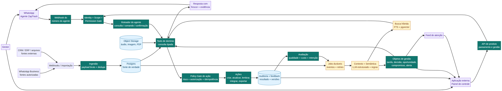

# ZapTrack — Arquitetura Definitiva com Agente no WhatsApp e Aplicação Externa

**Data:** 26 de agosto de 2026  
**Escopo:** produto, arquitetura, stack, agente conversacional, dados, memória, ações, segurança, WhatsApp e roadmap.  
**Princípios:** simplicidade genial, inteligência pragmática, anticipatory design, opinionated software e less custom/more building blocks.

> **Decisão central:** o ZapTrack deve ser um produto de **dupla interface sobre um único núcleo**. O agente no próprio WhatsApp é a interface de velocidade, consulta e comando. A aplicação externa é o centro de onboarding, revisão, configuração, exploração, métricas, arquivos, permissões e auditoria.

---

## 1. Reenquadramento correto do produto

A inclusão do agente no WhatsApp não diminui o conceito de organizador e estruturador de conversas. Pelo contrário: ela torna o conceito mais completo.

O ZapTrack deve ser definido como:

> **Um organizador inteligente de conversas de negócio que estrutura mensagens, contexto e mídias e os transforma em objetos de gestão — tarefas, decisões, oportunidades, compromissos e alertas — permitindo consultar e operar tudo pelo WhatsApp ou pela aplicação externa.**

O agente não é um adereço de IA. Ele é uma das duas superfícies principais do produto. Porém, ele também não deve conter uma lógica paralela. O agente deve chamar as mesmas ferramentas de domínio utilizadas pela aplicação.

A hierarquia estratégica fica assim:

| Camada | Definição |
|---|---|
| Categoria | Organizador e estruturador inteligente de conversas. |
| Transformação | Conversas e mensagens viram objetos de gestão. |
| Interface de acesso rápido | Agente conversacional dentro do WhatsApp. |
| Interface de profundidade | Aplicação externa de controle, revisão e exploração. |
| Resultado | Conversas importantes deixam de morrer no chat e passam a produzir gestão rastreável. |

A frase mais forte passa a ser:

> **Organize suas conversas. Transforme o que foi dito em gestão. Consulte e opere tudo pelo WhatsApp.**

---

## 2. Alerta de viabilidade: “próprio WhatsApp” possui dois significados

É importante separar duas ideias diferentes:

| Ideia | Viabilidade pelo caminho oficial |
|---|---|
| O usuário conversa com um agente ZapTrack dentro do seu WhatsApp | **Sim**, usando um número próprio do agente e a WhatsApp Business Platform. |
| O agente lê todas as conversas e grupos do WhatsApp pessoal do usuário | **Não deve ser prometido** por API oficial. |
| O agente acessa conversas elegíveis do WhatsApp Business App do negócio | **Possível em coexistência**, com consentimento e limitações. |
| O agente acessa grupos comuns já existentes | **Não pelo fluxo oficial padrão** de histórico da coexistência. |
| O usuário encaminha uma mensagem, áudio, documento ou exportação para o agente | **Sim**, desde que o conteúdo seja efetivamente enviado ao número do agente ou importado. |
| O negócio cria grupos específicos por API para colaboração | Possível apenas no modelo e elegibilidade da Groups API, que não equivale a ler grupos existentes. |

A documentação oficial da coexistência do WhatsApp Business App prevê o compartilhamento voluntário de histórico e contatos com um provedor, mas informa que mensagens de grupos não são incluídas no histórico compartilhado.[1] A referência do webhook de histórico informa que a sincronização pode cobrir mensagens dentro de 180 dias do onboarding, que payloads podem conter milhares de mensagens e que o processamento deve ser assíncrono.[2]

A Groups API é uma categoria diferente: permite criar e gerenciar grupos para mensagens e colaboração, com convite por link, elegibilidade específica, limite documentado de até oito participantes e indisponibilidade para números do WhatsApp Business App.[3] Ela não representa acesso geral a grupos pessoais ou grupos comuns já existentes.

### Consequência para o produto

O ZapTrack deve comunicar quatro fontes distintas:

1. **Conversas do agente:** sempre consultáveis no histórico do número do agente.
2. **Fontes empresariais elegíveis:** sincronizadas por Cloud API/coexistência, conforme escopo e consentimento.
3. **Conteúdo encaminhado pelo usuário:** mensagens, arquivos, áudios e exportações que o usuário enviar ao agente ou importar na aplicação.
4. **Grupos API do ZapTrack:** eventualmente, grupos novos e específicos de colaboração, caso a elegibilidade do negócio permita.

A promessa correta é **“consulte tudo o que o ZapTrack organizou e ao que você tem permissão de acesso”**, não “o ZapTrack lê todo o seu WhatsApp”.

---

## 3. Arquitetura de números e canais

A decisão mais importante é separar o número que fornece dados do número pelo qual o usuário conversa com o agente.

```text
Números do negócio / fontes        Número do agente ZapTrack
         │                                      │
         │ conversas e eventos                  │ perguntas e comandos
         v                                      v
  Ingestão e estruturação              Webhook do agente
         │                                      │
         └──────────────┬───────────────────────┘
                        v
                Núcleo compartilhado
```

### Número do agente ZapTrack

O agente deve ter um número próprio, reconhecível e separado do atendimento da empresa. Esse número recebe perguntas, comandos, confirmações, arquivos encaminhados e solicitações de consulta. Ele envia respostas, resumos, alertas e links seguros para a aplicação.

Não é recomendável misturar, no mesmo número, mensagens de clientes, mensagens internas da operação e comandos do gestor. Isso aumentaria a chance de loops, vazamentos de contexto, respostas ao destinatário errado e falhas de auditoria.

### Fontes de dados do negócio

As fontes podem ser WhatsApp Business Platform, coexistência com WhatsApp Business App, importações CSV/JSON, arquivos encaminhados, e posteriormente CRM, ERP, e-mail ou sistemas verticais. Cada fonte possui escopo, status, permissões, última sincronização e política de retenção.

A ingestão das fontes e a conversa com o agente são fluxos diferentes, mas convergem no mesmo banco e no mesmo modelo de objetos.

---

## 4. Núcleo compartilhado

O núcleo é a única fonte de verdade para as duas interfaces. Nem o agente nem a aplicação podem manter uma “memória própria” de objetos ou regras.



A arquitetura recomendada é um **monólito modular orientado a eventos**, com os seguintes planos:

| Plano | Função |
|---|---|
| Data plane | Receber, persistir e normalizar mensagens, arquivos e eventos. |
| Knowledge plane | Manter contexto, entidades, evidências, embeddings e objetos. |
| Action plane | Validar comandos, permissões, confirmação, execução e reversão. |
| Agent plane | Interpretar perguntas, selecionar ferramentas e redigir respostas. |
| Experience plane | Renderizar resultados no WhatsApp e na aplicação. |

O Agent plane nunca deve consultar tabelas diretamente. Ele chama ferramentas de domínio tipadas. Essa decisão impede que o agente escape das regras de segurança ou invente consultas não auditadas.

### Módulos internos

| Módulo | Responsabilidade |
|---|---|
| Identity & Workspace | Usuários, times, papéis, workspaces e permissões. |
| Pairing | Pareamento de telefone, códigos, revogação e vínculo com workspace. |
| Connectors | Fontes, escopos, credenciais referenciadas e sincronização. |
| Ingestion | Webhooks, importação, deduplicação e persistência bruta. |
| Conversation Context | Conversas, participantes, threads, empresas e histórico. |
| Semantic Processing | Entidades, intents, relações, embeddings, confiança e evidência. |
| Management Objects | Tarefas, decisões, oportunidades, compromissos e alertas. |
| Agent Router | Consulta, comando, confirmação, desambiguação e ajuda. |
| Domain Tools | Busca, leitura, criação, edição, conclusão e ações. |
| Action & Automation | Policy gate, execução, integração, retry e reversão. |
| Search & Feed | Busca híbrida e feed de atenção. |
| Evaluation & Audit | Feedback, versões, custos, qualidade e trilha de auditoria. |

---

## 5. Responsabilidade de cada interface

A dupla interface não é duplicação. É **progressive disclosure**: o WhatsApp oferece velocidade; a aplicação revela profundidade quando ela é necessária.

| Capacidade | Agente no WhatsApp | Aplicação externa |
|---|---|---|
| Consulta rápida | Principal | Disponível |
| Busca contextual | Natural language + comandos | Filtros, busca híbrida e timeline |
| Tarefas e objetos | Consultar, criar, editar e concluir | Tabela, quadro, lote e detalhe |
| Evidência | Trecho e referência compacta | Conversa completa e navegação |
| Métricas | Perguntas com período e escopo | Dashboard, drill-down e exportação |
| Arquivos | Resumo, busca e envio controlado | Biblioteca, preview e gestão |
| Alertas | Digest e notificações agrupadas | Configuração, histórico e silêncio |
| Pareamento | Código de uso único | Criação e revogação |
| Permissões | Consulta simples | Administração completa |
| Auditoria | Resumo e link | Trilha detalhada |
| Configuração | Comandos seguros | Centro de controle |
| Revisão em massa | Não recomendada | Principal |

O usuário deve poder viver no WhatsApp durante o dia e abrir a aplicação somente quando precisar revisar muitos itens, explorar evidências, administrar políticas ou analisar o negócio em profundidade.

---

## 6. Agente conversacional: arquitetura funcional

### 6.1 Fluxo de consulta

```text
Mensagem do usuário
       ↓
Identidade + workspace + escopo
       ↓
Roteador: consulta / comando / confirmação / correção
       ↓
Ferramentas de domínio tipadas
       ↓
Objetos e métricas estruturadas
       ↓
Evidências e arquivos quando necessário
       ↓
Resposta com frescor, escopo e próximo passo
```

Para uma pergunta como “quais oportunidades estão sem retorno?”, o agente deve consultar primeiro objetos de gestão, aplicar filtros de status e tempo, buscar evidências apenas para os itens relevantes e responder com data de atualização. Ele não deve começar por um LLM lendo toda a base.

### 6.2 Fluxo de ação

```text
Comando do usuário
       ↓
Interpretar intenção e parâmetros
       ↓
Resolver objeto, owner, prazo e escopo
       ↓
Validar schema, permissão e evidência
       ↓
Policy gate de risco
       ↓
Executar ou pedir confirmação
       ↓
Registrar ação, resultado e auditoria
```

### 6.3 Ferramentas iniciais

| Ferramenta | Tipo | Exemplo |
|---|---|---|
| `search_conversations` | Consulta | “Busque conversas sobre renovação.” |
| `search_messages` | Consulta | “Encontre quando falamos de preço.” |
| `get_evidence` | Consulta | “Mostre de onde veio essa tarefa.” |
| `list_management_objects` | Consulta | “Quais pendências vencem hoje?” |
| `get_management_object` | Consulta | “Detalhe a oportunidade Alfa.” |
| `list_attention_items` | Consulta | “O que precisa de atenção?” |
| `get_metric` | Consulta | “Quantas propostas foram enviadas este mês?” |
| `search_files` | Consulta | “Ache o contrato da Beta.” |
| `get_file_summary` | Consulta | “Resuma o PDF encaminhado.” |
| `create_object_draft` | Escrita reversível | “Crie uma tarefa para amanhã.” |
| `update_object` | Escrita | “Atribua a tarefa à Ana.” |
| `complete_object` | Escrita | “Marque como concluída.” |
| `create_internal_reminder` | Escrita | “Lembre-me na sexta.” |
| `send_digest` | Ação controlada | “Envie o resumo ao gestor.” |
| `update_external_system` | Ação sensível | “Atualize o CRM.” |
| `send_customer_message` | Ação externa | Bloqueada no MVP ou confirmação forte. |

Não oferecer ferramentas genéricas como `run_sql`, `execute_code` ou `search_everything`. O agente deve operar por comandos de negócio explícitos.

---

## 7. Memória e verdade operacional

A arquitetura deve separar três memórias:

| Memória | Conteúdo | Regra |
|---|---|---|
| Conversa do agente | Perguntas, respostas, confirmações e referências recentes | Não é fonte de verdade. |
| Operacional | Objetos, status, owners, prazos, decisões, ações e resultados | Fonte principal para consultas e comandos. |
| Semântica | Entidades, relações, embeddings, análises e evidências | Serve à recuperação e interpretação. |

Se o usuário disser “conclua aquele item”, o sistema deve resolver a referência com workspace, histórico, estado e permissões. Se houver dois candidatos, deve perguntar.

A memória operacional deve ser mutável com histórico. A mensagem original deve ser imutável. Análises de IA podem receber novas versões, mas a versão anterior precisa permanecer auditável.

---

## 8. Objetos de gestão

A transformação central do ZapTrack é:

> **Mensagem → contexto → interpretação → objeto de gestão → ação.**

Os cinco objetos iniciais são:

| Objeto | Exemplo |
|---|---|
| Tarefa/follow-up | “Enviar proposta até sexta.” |
| Decisão | “Migrar para a nova solução no dia 15.” |
| Oportunidade | “Cliente pediu condições comerciais.” |
| Compromisso | “Pagamento será feito hoje.” |
| Alerta/ocorrência | “Cliente está esperando há três dias.” |

Cada objeto deve possuir `object_id`, `workspace_id`, `type`, `title`, `status`, `priority`, `owner`, `due_at`, `source_message_ids`, `confidence`, `created_by`, `updated_at` e histórico.

A aplicação mostra o objeto em profundidade. O agente mostra uma versão compacta e acionável:

> **4 pendências vencem hoje.** A mais urgente é a proposta da Alfa, prometida em 12/08 e ainda sem confirmação. Posso criar um lembrete para você ou abrir os detalhes na aplicação.

---

## 9. Consultas, métricas e arquivos

### 9.1 Consultas estruturadas primeiro

O agente deve consultar objetos e métricas estruturadas antes de recorrer à busca semântica. Isso reduz custo, latência e alucinação.

Consultas como “minhas pendências”, “oportunidades sem retorno” e “decisões da semana” devem usar filtros definidos. Perguntas abertas como “o que foi decidido sobre o fornecedor?” podem combinar objetos, busca semântica e evidências.

### 9.2 Métricas com definição

Cada métrica precisa possuir nome, definição, fórmula, fonte, filtros, período, timezone, frescor e versão. O LLM apenas interpreta a pergunta e redige o resultado; não calcula números improvisando.

A resposta deve dizer:

> **12 oportunidades foram criadas entre 1º e 26 de agosto, considerando objetos classificados como “oportunidade” e status diferente de “descartada”. Dados atualizados às 18h04.**

A aplicação permite drill-down para as 12 oportunidades e respectivas evidências.

### 9.3 Arquivos e mídias

O pipeline de arquivos é:

```text
arquivo recebido
  → checksum e storage
  → MIME, tamanho e retenção
  → transcrição/OCR autorizado
  → indexação de texto e metadados
  → vínculo com mensagem/conversa/objeto
  → resumo ou resposta com evidência
```

Para um arquivo pequeno, o agente pode resumir ou devolver o conteúdo. Para arquivo grande, muitos resultados ou auditoria, ele envia um link seguro para a aplicação.

O agente nunca deve afirmar que leu um arquivo se não possui texto, OCR, transcrição ou permissão para acessá-lo.

---

## 10. Identidade, pareamento e permissões

O número de telefone identifica um possível usuário, mas não deve abrir acesso automático ao workspace. O pareamento recomendado é:

1. O usuário cria ou acessa um workspace na aplicação.
2. A aplicação gera um código de uso único e expiração curta.
3. O usuário envia `VINCULAR <código>` ao agente.
4. O backend vincula o telefone ao membro e ao workspace.
5. O agente confirma o escopo e o papel.
6. Revogação, troca de workspace e privilégio exigem novo fluxo.

Toda chamada de ferramenta deve carregar identidade, workspace, papel, fontes permitidas, objetos permitidos, ações permitidas e estado de consentimento.

A autorização acontece antes da recuperação e novamente antes da ação. Não recuperar “tudo” e tentar filtrar depois.

### Ações por nível de risco

| Ação | Política |
|---|---|
| Mostrar resumo/evidência | Automática |
| Sugerir objeto | Automática, aguardando revisão |
| Criar rascunho | Automática, editável |
| Criar tarefa interna | Permitida conforme política do workspace |
| Delegar tarefa | Confirmação no início |
| Atualizar CRM/ERP | Política aprovada + confirmação |
| Exportar dados | Admin + confirmação forte |
| Enviar mensagem a cliente | Confirmação forte; bloqueada no MVP por padrão |
| Excluir dados | Aplicação externa + confirmação forte |
| Cobrar, cancelar, conceder desconto ou alterar contrato | Bloqueado no MVP |

---

## 11. Stack recomendada

Para um produto independente, a stack continua sendo:

| Camada | Tecnologia |
|---|---|
| Aplicação web | Next.js + React + TypeScript |
| UI | Tailwind CSS + shadcn/ui |
| API | Route Handlers + Server Actions + Zod |
| Banco | Supabase Postgres |
| Auth | Supabase Auth + RLS |
| Busca | Postgres Full-Text Search + pgvector |
| Arquivos | Supabase Storage |
| Jobs | Inngest |
| IA | AI SDK + gateway de provedores |
| Canal | WhatsApp Business Platform/Cloud API oficial |
| Observabilidade | Sentry + logs estruturados |
| Produto | PostHog ou equivalente, sem conteúdo bruto |
| Deploy | Plataforma gerenciada |

Supabase reúne Postgres, Auth, RLS, Storage, Realtime, APIs e vetores em uma mesma plataforma.[4] Inngest oferece funções orientadas a eventos, cron e webhook com retries, steps e execução durável.[5] O AI SDK oferece geração de dados estruturados com schemas e suporte a múltiplos provedores.[6]

### Opção de piloto no ambiente Manus

Se o objetivo for validar o produto com menor setup dentro do ambiente Manus, usar o stack nativo de aplicação full-stack: React/Vite, Express, tRPC, Drizzle/TiDB, storage e LLM integrados. Essa é uma rota rápida para piloto, mas não deve ser misturada com Next.js/Supabase no mesmo projeto.

A decisão opinativa é: **um banco, uma API, um sistema de jobs, um gateway de IA e um modelo de domínio**. O agente e a aplicação não devem virar dois produtos tecnicamente independentes.

---

## 12. Eventos e processamento assíncrono

Eventos canônicos:

| Evento | Consequência |
|---|---|
| `source.connected` | Inicia sincronização/configuração. |
| `message.received` | Persiste e agenda processamento. |
| `conversation.ready` | Abre janela para análise. |
| `analysis.completed` | Gera propostas de objeto. |
| `object.proposed` | Atualiza feed e pode notificar. |
| `object.accepted` | Cria/atualiza estado oficial. |
| `action.requested` | Passa pelo policy gate. |
| `action.succeeded` | Registra resultado e feedback. |
| `action.failed` | Reprocessa ou apresenta erro. |
| `feedback.recorded` | Alimenta avaliação e melhoria. |

O webhook deve validar origem, deduplicar, persistir e responder rapidamente. Não deve executar análise pesada dentro do request. Os jobs processam normalização, mídia, extração, busca, objetos e notificações.

A Meta informa que webhooks podem ser reenviados após falhas e que retries podem gerar notificações duplicadas.[7] Logo, a chave externa e a idempotência são obrigatórias.

---

## 13. Segurança e privacidade

A conveniência do WhatsApp não pode remover a governança da aplicação. O lançamento deve incluir isolamento por workspace, RLS/RBAC, escopo de captura, retenção configurável, exclusão, exportação, criptografia, secrets gerenciados, mascaramento em logs/prompts, controle de mídias, auditoria e resposta a incidentes.

A política da WhatsApp Business Messaging atribui à empresa a responsabilidade por avisos, permissões, consentimentos, política de privacidade, opt-in e respeito a solicitações de opt-out.[8] Portanto, o onboarding deve explicar quais dados são capturados, de quais fontes, para qual finalidade, por quanto tempo e por quem podem ser consultados.

Conversas de terceiros devem ser tratadas como dados potencialmente pessoais. Não usar conteúdo de clientes para treinamento geral de modelos de forma opaca. Não classificar colaboradores como “hater”, “detrator”, “influenciador” ou “risco” no MVP. Não usar “compliance score” genérico.

Toda resposta do agente deve ser auditável por:

- usuário e workspace que perguntaram;
- fontes e mensagens consultadas;
- ferramentas chamadas;
- versão do modelo e do prompt;
- objeto criado ou alterado;
- confirmação recebida;
- ação externa executada;
- resultado, erro ou reversão.

---

## 14. Experiência opinativa do agente

O agente deve oferecer linguagem natural, mas também comandos curtos para situações de baixa conectividade, confirmação e previsibilidade.

```text
AJUDA
VINCULAR <código>
MINHAS PENDÊNCIAS
VENCENDO HOJE
OPORTUNIDADES SEM RETORNO
DECISÕES DA SEMANA
RESUMIR <empresa/conversa>
CRIAR TAREFA <descrição>
CONCLUIR <id>
PAUSAR ALERTAS
ABRIR NA APLICAÇÃO
```

Respostas devem ser compactas e progressivas: primeiro conclusão, depois evidência e detalhes sob demanda. O agente deve oferecer links profundos para a aplicação quando houver necessidade de revisão ampla.

Exemplo de desambiguação:

> Encontrei duas conversas com a Alfa: **proposta de agosto** e **renovação de setembro**. Qual delas você quer consultar?

Exemplo de consulta:

> Você tem **4 pendências vencendo hoje**. A mais urgente é a proposta da Alfa, prometida em 12/08 e sem confirmação. Posso criar um lembrete interno ou abrir os detalhes na aplicação.

Exemplo de correção:

> Entendi que isso é uma oportunidade, mas a confiança é baixa porque o cliente não confirmou compra. Quer salvar como **oportunidade**, **tarefa de follow-up** ou deixar sem classificar?

---

## 15. Roadmap revisado

A introdução do agente deve acontecer cedo, mas com escopo pequeno. Não esperar meses para construir o canal; também não construir um agente geral antes de possuir dados e objetos confiáveis.

| Fase | Entrega | Critério de saída |
|---|---|---|
| 0–7 dias | Feasibility gate: número do agente, conta Meta, elegibilidade, fluxo de pareamento e escopo de fonte | Confirmar o que é oficialmente sincronizável; eliminar a promessa de grupos comuns se não houver caminho elegível. |
| 8–30 dias | Workspace, identidade, pareamento, ingestão/importação, cinco objetos, ferramentas de consulta e agente com respostas de leitura | Usuário pergunta no WhatsApp e recebe resposta baseada em dados estruturados e evidência. |
| 31–60 dias | Criação/edição de rascunho, confirmações, feed externo, busca, arquivos encaminhados e auditoria | Usuário transforma conversa em objeto pelo WhatsApp e revisa na aplicação. |
| 61–90 dias | Piloto com 3–5 empresas do mesmo ICP, alertas agrupados, tarefas internas, feedback, custos e avaliação | Uso recorrente, qualidade mensurada e perda evitada demonstrável. |
| 3–6 meses | Coexistência/Cloud API robusta, retenção/exclusão, métricas, integrações de destino e permissões avançadas | Primeiro produto pago com governança. |
| 6–12 meses | Segundo vertical, automações de baixo risco e agentes supervisionados específicos | Expansão controlada. |
| 12+ meses | Groups API quando elegível, agentes avançados, múltiplos verticais e knowledge graph sob demanda | Ecossistema, sem antecipar complexidade. |

### Critério de passagem

Não liberar ações externas porque o agente “parece inteligente”. Liberar quando houver evidência de precisão, autorização, idempotência, auditoria, reversão e hábito de uso.

---

## 16. O que não construir agora

Não construir leitura invisível de WhatsApp pessoal, acesso total a grupos comuns, CRM completo, omnichannel, dashboard executivo sofisticado, workflow builder genérico, agentes autônomos de atendimento, cobrança automática, alteração de contratos, gamificação, score reputacional ou uma arquitetura distribuída de microserviços.

Também não construir um “agente que sabe tudo” antes de implementar: identidade, escopo, busca estruturada, evidência, ferramentas tipadas, confirmação e auditoria.

---

## 17. Veredito definitivo

O ZapTrack deve ser um **organizador e estruturador inteligente de conversas**, cujo resultado são objetos de gestão confiáveis. O agente no WhatsApp deve ser a interface principal de acesso cotidiano, consulta e comando. A aplicação externa deve ser o centro de controle, profundidade e governança.

A fórmula final é:

> **WhatsApp é o cockpit. A aplicação é o centro de comando. O núcleo de objetos e evidências é a única fonte de verdade.**

A melhor stack continua sendo **Next.js + TypeScript + Supabase/Postgres + pgvector + Inngest + AI SDK + WhatsApp Business Platform oficial**, com uma alternativa nativa de aplicação full-stack para piloto de menor setup.

A decisão estratégica mais importante é não vender “acesso total ao WhatsApp” se o canal oficial não o permitir. Vender e construir o que pode ser comprovado:

> **O ZapTrack organiza as conversas às quais você autorizou acesso, transforma o conteúdo em gestão e permite consultar e operar os resultados diretamente pelo WhatsApp — com profundidade, revisão e governança na aplicação.**

Esse posicionamento mantém a visão ambiciosa, protege a viabilidade técnica e transforma o agente de WhatsApp em uma vantagem real, sem sacrificar a aplicação externa.

## Referências externas

[1]: https://developers.facebook.com/documentation/business-messaging/whatsapp/embedded-signup/onboarding-business-app-users — Meta for Developers, “Onboard WhatsApp Business app users”.

[2]: https://developers.facebook.com/documentation/business-messaging/whatsapp/webhooks/reference/history — Meta for Developers, “history webhook reference”.

[3]: https://developers.facebook.com/documentation/business-messaging/whatsapp/groups — Meta for Developers, “Groups API”.

[4]: https://supabase.com/ — Supabase, plataforma Postgres com Authentication, Storage, Realtime e Vector.

[5]: https://www.inngest.com/docs/learn/inngest-functions — Inngest, funções duráveis, eventos, cron, webhooks, retries e steps.

[6]: https://ai-sdk.dev/docs/ai-sdk-core/generating-structured-data — AI SDK, geração de dados estruturados e validação por schema.

[7]: https://developers.facebook.com/documentation/business-messaging/whatsapp/webhooks/overview — Meta for Developers, “Webhooks”.

[8]: https://whatsappbusiness.com/policy/ — WhatsApp Business Messaging Policy.

## Documentos internos relacionados

`zaptrack_dual_interface_architecture.md`, `zaptrack_dual_interface_governance.md`, `zaptrack_agent_experience.md`, `zaptrack_whatsapp_agent_research.md`, `zaptrack_stack_recommendation.md`, `zaptrack_architecture_blueprint.md` e `zaptrack_ai_ops_roadmap.md`.
