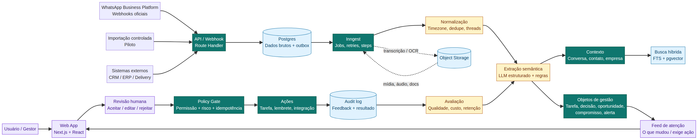

# ZapTrack — Arquitetura e Stack Master

## Simplicidade genial, inteligência pragmática e software opinativo

**Data:** 26 de agosto de 2026  
**Escopo:** arquitetura de produto, aplicação, dados, IA, integrações, segurança, operação e roadmap técnico.  
**Princípios:** simplicity by default, anticipatory design, opinionated software, less custom/more building blocks.

> **Decisão central:** o ZapTrack deve ser um **monólito modular orientado a eventos**, com uma aplicação web, um banco relacional gerenciado, uma camada gerenciada de jobs, busca híbrida no próprio banco e uma camada de IA com saída estruturada.

A arquitetura não deve começar como um ecossistema de microserviços, agentes autônomos e múltiplos produtos. Ela deve começar como uma unidade simples, confiável e extensível que executa um loop completo:

> **Capturar conversa → estruturar significado → criar objeto de gestão → pedir confirmação → executar próximo passo → aprender com o resultado.**

---

## 1. Recomendação executiva

Para o produto independente e comercial, a stack recomendada é:

| Camada | Escolha recomendada |
|---|---|
| Aplicação | **Next.js + React + TypeScript** |
| Interface | Tailwind CSS + shadcn/ui |
| API | Route Handlers e Server Actions; contratos validados com Zod |
| Banco | **Supabase Postgres** |
| Autenticação/autorização | Supabase Auth + Row Level Security |
| Arquivos | Supabase Storage |
| Busca | Postgres Full-Text Search + pgvector |
| Jobs/eventos | **Inngest** |
| IA | **AI SDK com gateway de provedores** |
| WhatsApp | WhatsApp Business Platform/Cloud API oficial |
| Transcrição/OCR | Serviço gerenciado, atrás de uma interface simples |
| Observabilidade | Sentry + logs estruturados + métricas de jobs |
| Analytics de produto | PostHog ou equivalente, sem conteúdo bruto de conversas |
| Deploy | Plataforma gerenciada para Next.js e serviços escolhidos |

Essa escolha reduz a quantidade de componentes operacionais. O Supabase reúne Postgres, autenticação, RLS, Storage, Realtime, APIs e vetores/embeddings em uma mesma plataforma.[1] O Inngest oferece funções disparadas por eventos, cron ou webhook com jobs em background, retries, steps e execução durável.[2] O AI SDK oferece uma interface unificada para provedores e geração de dados estruturados com schemas, o que é adequado para transformar mensagens em objetos de gestão tipados.[3]

### Decisão prática para o primeiro build

Há duas rotas tecnicamente válidas:

| Abordagem | Trade-offs | Custo | Complexidade |
|---|---|---|---|
| **A. Produto independente: Next.js + Supabase + Inngest** | Maior portabilidade, Postgres/RLS forte e arquitetura alinhada à visão de plataforma; exige configurar contas, secrets, deploy e integrações. | Baixo a médio no início; variável conforme banco, storage, jobs, IA e WhatsApp. | Média |
| **B. Piloto dentro do ambiente Manus: React/Vite + Express/tRPC + Drizzle/TiDB + storage/LLM integrados** | Menor setup e velocidade máxima para protótipo/piloto; maior acoplamento à plataforma e banco diferente do desenho Supabase. | Baixo para iniciar; variável conforme uso da plataforma e IA. | **Baixa** |
| C. Low-code/automation-first | Muito rápido para demo, mas espalha estado e aumenta risco de manutenção, governança e dependência de conectores. | Baixo no protótipo; pode crescer rapidamente com volume. | Baixa no início, alta depois |

**Minha recomendação:** usar a **Opção A como arquitetura de produto** e a Opção B somente se o objetivo imediato for validar o MVP com o menor atrito possível dentro do ambiente Manus. Não misturar Next.js/Supabase com React/Vite/tRPC/Drizzle no mesmo produto. O domínio e os contratos devem ser os mesmos, mas a infraestrutura deve ser escolhida uma única vez por projeto.

---

## 2. Os cinco princípios traduzidos em decisões

### 2.1 Simplicidade genial

Simplicidade genial significa reduzir decisões que o usuário precisa tomar e reduzir componentes que a equipe precisa operar. O ZapTrack deve possuir uma fonte de verdade, um fluxo principal, uma ontologia inicial pequena e uma política de automação clara.

As decisões são: uma aplicação web, um banco principal, um orquestrador de jobs, uma busca integrada, cinco objetos de gestão prioritários e uma tela inicial de atenção. Não haverá um produto separado para cada capacidade.

### 2.2 Inteligência pragmática

A IA deve resolver ambiguidade linguística, contexto e síntese. Código determinístico deve resolver autenticação, permissões, deduplicação, datas, moeda, idempotência, severidade, políticas e validações.

O ZapTrack não deve usar um LLM para decidir algo que uma regra simples resolve melhor. A IA interpreta; o domínio valida; a política autoriza; o sistema registra.

### 2.3 Anticipatory design

O produto não deve esperar que o gestor leia todas as conversas ou saiba onde procurar. A primeira tela deve mostrar o que mudou, o que está atrasado, o que ficou sem resposta, o que possui impacto e o que exige confirmação.

Antecipar não significa agir escondido. Cada recomendação deve mostrar **o que aconteceu, por que importa, qual evidência sustenta a conclusão e qual próximo passo é sugerido**.

### 2.4 Opinionated software

O ZapTrack deve decidir bons padrões pelo usuário. O sistema começa com status, prioridades, tipos de objeto, regras de atenção, formatos de resumo e níveis de autonomia pré-configurados.

Não pedir ao usuário que configure modelo, prompt, embedding, dezenas de thresholds ou um construtor de workflow. A customização entra depois, quando um padrão de uso estiver validado.

### 2.5 Less custom, more building blocks

O código proprietário deve concentrar-se no que diferencia o produto: **semântica de negócio, contexto, proveniência, objetos de gestão, ranking de atenção, policy gate e feedback**.

Autenticação, storage, banco, busca vetorial, jobs, retries, observabilidade, componentes visuais, transcrição e chamadas de modelos devem ser comprados ou integrados.

---

## 3. Arquitetura geral recomendada



A arquitetura deve ser um **monólito modular**, não um monólito acidental. Os módulos têm fronteiras explícitas, contratos próprios, schemas versionados e testes, mas compartilham deploy e banco enquanto o produto ainda está aprendendo.

```text
WhatsApp/API oficial ─┐
Importação controlada ─┼─> API de ingestão ─> Postgres + outbox
CRM/ERP/Delivery ─────┘                            │
                                                   v
                                        Jobs assíncronos gerenciados
                                                   │
                          normalizar → segmentar → extrair → contextualizar
                                                   │
                                                   v
                                  Proposta de objeto de gestão
                                                   │
                                                   v
                                   Feed de atenção e evidência
                                                   │
                                      aceitar / editar / rejeitar
                                                   │
                                                   v
                                       Policy gate de ação
                                                   │
                             tarefa / lembrete / integração / bloqueio
                                                   │
                                                   v
                                  feedback + auditoria + resultado
```

### Módulos internos

| Módulo | Responsabilidade | Grau de propriedade |
|---|---|---:|
| Identity & Workspace | Usuários, times, papéis, permissões e isolamento | Parcial |
| Connectors | Fontes, escopos, credenciais referenciadas e sincronização | Parcial |
| Ingestion | Webhooks, importação, deduplicação e persistência bruta | Alto |
| Conversation Context | Conversas, participantes, threads, empresas e histórico | Alto |
| Semantic Processing | Normalização, entidades, intents, embeddings e confiança | Alto |
| Management Objects | Tarefas, decisões, oportunidades, compromissos e alertas | **Muito alto** |
| Action & Automation | Confirmação, delegação, lembrete, integração e reversão | **Muito alto** |
| Search & Feed | Busca híbrida, ranking, filtros e feed de atenção | Alto |
| Insights & Metrics | Métricas, tendências e explicações | Médio/alto |
| Evaluation & Audit | Feedback, versões, qualidade, custos e trilha de auditoria | **Muito alto** |

---

## 4. Arquitetura de aplicação

### 4.1 Frontend

Usar Next.js com App Router, React e TypeScript. A mesma aplicação contém a landing page, onboarding, área autenticada e experiência de gestão. Não criar frontend e backend separados no início.

A interface usa Tailwind CSS e shadcn/ui para reduzir CSS e componentes proprietários. A customização deve concentrar-se nas superfícies que representam a diferenciação do ZapTrack:

| Superfície | Função |
|---|---|
| Feed de atenção | Mostra o que mudou e o que exige ação. |
| Contexto da conversa | Mostra mensagens, participantes, entidades e evidências. |
| Objeto de gestão | Mostra status, prazo, owner, origem, confiança e histórico. |
| Confirmação | Permite aceitar, editar, rejeitar, silenciar ou desfazer. |
| Busca | Recupera conversas e objetos por linguagem natural e filtros. |

Não usar Redux ou outro gerenciador global no MVP. Usar estado de URL para filtros e navegação, Server Components onde fizer sentido e estado local para interações. Adicionar uma camada de estado global somente diante de uma necessidade comprovada.

### 4.2 API

Na Opção A, escolher Route Handlers e Server Actions com Zod. Não criar uma camada REST genérica e não duplicar contratos em vários arquivos.

Endpoints essenciais:

| Endpoint | Responsabilidade |
|---|---|
| `POST /api/webhooks/whatsapp` | Receber e persistir eventos do WhatsApp. |
| `POST /api/imports/conversations` | Iniciar importação controlada. |
| `GET /api/attention` | Consultar feed de atenção já filtrado por permissão. |
| `POST /api/objects/:id/decision` | Aceitar, editar, rejeitar ou pedir contexto. |
| `POST /api/actions/:id/execute` | Executar ação autorizada e idempotente. |
| `POST /api/feedback` | Registrar utilidade e correção. |

Na Opção B, usar tRPC conforme o template do ambiente, sem criar REST paralelo. O princípio é o mesmo: contratos tipados e uma única forma de comunicação entre UI e servidor.

### 4.3 Background jobs

O request de webhook deve fazer apenas autenticação da origem, validação básica, deduplicação inicial, persistência e resposta rápida. A Meta documenta que webhooks informam mensagens e outros eventos, que payloads podem atingir 3 MB, que falhas podem gerar retries por até 7 dias e que retries podem resultar em notificações duplicadas.[4]

Depois da persistência, o job executa normalização, segmentação, transcrição/OCR quando autorizado, extração, classificação, recuperação de contexto, criação de proposta de objeto e atualização do feed.

Jobs iniciais:

| Job | Função |
|---|---|
| `ingest-message` | Validar, deduplicar e persistir mensagem/evento. |
| `process-conversation-window` | Analisar a janela contextual impactada. |
| `enrich-media` | Transcrever áudio e extrair texto de documentos/imagens. |
| `build-object-proposals` | Gerar propostas de tarefa, decisão, oportunidade ou alerta. |
| `refresh-attention-feed` | Recalcular prioridade e suprimir duplicidades. |
| `send-digest` | Gerar resumo diário/semanal sob configuração do workspace. |
| `reprocess-conversation` | Reexecutar uma conversa por nova versão de pipeline. |

Cada job deve ter `job_id`, `tenant_id`, `correlation_id`, `attempt`, `pipeline_version`, `started_at`, `finished_at`, `status` e `error_code`.

---

## 5. Arquitetura de dados

O Postgres é a fonte de verdade. Não usar event sourcing completo no MVP. Persistir os fatos essenciais em tabelas relacionais e manter um ledger append-only para eventos de integração, processamento e ação.

### 5.1 Modelo canônico

| Entidade | Papel |
|---|---|
| `workspace` | Limite organizacional e de segurança. |
| `member` | Usuário, papel e permissões. |
| `connector` | Fonte de dados e escopo de acesso. |
| `company` | Empresa relacionada às conversas. |
| `contact` | Pessoa ou identidade externa. |
| `conversation` | Local contextual da interação. |
| `message` | Evidência bruta e imutável. |
| `attachment` | Referência a áudio, imagem ou documento no storage. |
| `analysis` | Interpretação versionada da IA. |
| `entity` | Valor, data, pessoa, produto, contrato, pedido ou outro conceito extraído. |
| `management_object` | Tarefa, decisão, oportunidade, compromisso ou alerta. |
| `object_relation` | Relação entre mensagem, entidade, objeto, empresa e conversa. |
| `action` | Efeito pretendido ou executado. |
| `feedback` | Aceite, edição, rejeição ou avaliação humana. |
| `audit_log` | Acesso, alteração, processamento e decisão. |
| `job_run` | Execução de background job. |

### 5.2 Regras de dados

A mensagem original nunca deve ser sobrescrita. A análise pode receber novas versões, mas a versão anterior permanece disponível para auditoria. Todo objeto precisa apontar para uma mensagem ou intervalo de mensagens de origem.

Conteúdo binário não deve ir para colunas do banco. O banco guarda `storage_key`, MIME, tamanho, checksum, transcrição, OCR, retenção e status de processamento; os bytes ficam no object storage.

O schema de `management_object` pode usar um núcleo relacional comum e campos específicos em JSONB validado. Quando um vertical provar necessidade e volume, seus atributos podem migrar para tabelas específicas.

### 5.3 Relações mínimas

```text
workspace 1 ── N conversation
conversation 1 ── N message
message N ── N entity
message 1 ── N analysis
analysis 1 ── N management_object_proposal
management_object N ── N message
management_object N ── N management_object
management_object 1 ── N action
action 1 ── N audit_log
object/analysis 1 ── N feedback
```

Não construir um knowledge graph completo. A modelagem relacional com relações explícitas já permite preservar o significado necessário para o MVP.

---

## 6. Objetos de gestão

O ZapTrack não deve tratar mensagem, sentimento, insight, documento e tarefa como se fossem a mesma categoria. A distinção correta é:

| Classe | Exemplos | Ciclo de vida |
|---|---|---:|
| Evidência | Mensagem, áudio, imagem, documento, link | Registro de origem |
| Entidade | Pessoa, empresa, conversa, pedido, imóvel, contrato | Conforme o domínio |
| Trabalho | Tarefa, follow-up, ocorrência, atendimento | Sim |
| Compromisso | Promessa, decisão, prazo, aprovação | Sim |
| Oportunidade | Lead, oportunidade, renovação | Sim |
| Estado/risco | Atraso, pendência, insatisfação | Temporal |
| Conhecimento | Resumo, FAQ, insight, decisão documentada | Versionado |
| Métrica | Volume, SLA, conversão, tempo de resposta | Janela temporal |
| Ação | Notificação, criação, atualização, chamada externa | Auditável |

Os cinco objetos iniciais são:

1. **Tarefa/follow-up:** algo que alguém precisa fazer.
2. **Decisão:** algo que foi decidido ou precisa de decisão.
3. **Oportunidade:** sinal de compra, renovação ou expansão.
4. **Compromisso:** promessa, prazo ou condição assumida.
5. **Alerta/ocorrência:** evento que exige atenção, escalonamento ou investigação.

O intent responde “o que a pessoa quis dizer?”. O objeto de gestão responde “o que a empresa precisa acompanhar ou fazer?”. Essa é a transformação central do produto.

---

## 7. Inteligência artificial

### 7.1 Pipeline

1. Capturar origem, sequência, timestamp e duplicidade.
2. Normalizar abreviações, erros, idioma e timezone sem apagar o original.
3. Segmentar a conversa em janelas e threads.
4. Extrair entidades, valores, datas, responsáveis, produtos, pedidos e compromissos.
5. Classificar em multilabel, permitindo oportunidade + prazo + risco.
6. Resolver referências como “ele”, “aquele pedido” e “o cliente” somente quando houver confiança suficiente.
7. Gerar proposta de objeto com evidência, confiança e incertezas.
8. Aplicar policy gate para decidir entre informar, sugerir, pedir confirmação, executar ou bloquear.
9. Registrar feedback, conclusão e resultado.

### 7.2 Modelo de provedor

Usar uma camada fina e agnóstica, com um provedor primário e fallback. O usuário não escolhe modelo. A política interna escolhe o modelo por função, custo, latência e qualidade.

| Tier | Uso |
|---|---|
| Econômico | Detecção preliminar, normalização e triagem. |
| Equilibrado | Extração estruturada e classificação de objetos. |
| Avançado | Ambiguidade, resumo complexo, decisão assistida e análise transversal. |

Não construir um sistema próprio de treinamento de modelos no primeiro ciclo. O ativo proprietário é o schema de objetos, o conjunto de evidências, o feedback, o ranking e as políticas de ação.

### 7.3 Saída estruturada

Toda chamada que cria estrutura deve usar JSON Schema/Zod. O modelo não grava diretamente no banco. A aplicação valida:

- tipo de objeto;
- campos obrigatórios;
- datas e timezone;
- valores e moedas;
- evidência de origem;
- confiança mínima;
- conflito com histórico;
- permissão para a ação proposta.

Se falhar, o sistema deve pedir contexto ou enviar para revisão. Não forçar classificação para evitar uma métrica artificialmente alta.

### 7.4 Avaliação

A suíte sintética de 280 frases é adequada como smoke test, mas não comprova qualidade de produção.[I1] [I5] Ela deve evoluir para smoke, contraste, contexto multi-turno, multimídia, amostra real anonimizada, fora de escopo e regressão.

Medir precision, recall, calibração, abstention, severidade do erro, aceite, edição, rejeição, tempo até ação, custo por conversa e taxa de duplicidade. O indicador de negócio mais relevante é a porcentagem de objetos críticos que foram aceitos/corrigidos e levaram a uma ação útil.

---

## 8. Anticipatory design e policy gate

A antecipação do ZapTrack deve operar em duas camadas: **atenção** e **ação**.

### 8.1 Feed de atenção

A tela inicial mostra:

| Bloco | Conteúdo |
|---|---|
| O que mudou | Novas decisões, oportunidades, compromissos e riscos. |
| Vencendo | Itens próximos do prazo ou já atrasados. |
| Sem resposta | Conversas que exigem follow-up. |
| Precisa de confirmação | Propostas de objetos e ações pendentes. |
| Criado automaticamente | Objetos gerados pela IA. |
| Concluído | Resultado e histórico da ação. |

O ranking inicial pode combinar impacto, urgência, idade da pendência, gravidade, recência e ausência de resposta. O score é uma ordenação de atenção, não uma verdade objetiva. A interface deve explicar por que cada item foi priorizado.

### 8.2 Níveis de autonomia

| Nível | Comportamento | Primeira versão |
|---|---|---:|
| L0 | Indexa e mostra evidência | Sim |
| L1 | Sugere objeto ou ação | Sim |
| L2 | Cria rascunho editável | Sim |
| L3 | Executa ação interna reversível | Talvez |
| L4 | Atualiza sistema externo aprovado | Depois |
| L5 | Conversa autonomamente com cliente | Não |

Criar tarefa interna pode ser automático após uma política aprovada. Enviar mensagem para cliente, cobrar, cancelar, conceder desconto, alterar contrato ou confirmar pagamento exige confirmação explícita no MVP.

### 8.3 O que o sistema nunca deve fazer silenciosamente

O ZapTrack não deve transformar “👍” em venda fechada, “fechamos?” em negócio ganho, sentimento em diagnóstico certo ou probabilidade em fato. Todo resultado inferido precisa ser apresentado como inferência e acompanhado de evidência.

---

## 9. WhatsApp e integrações

O caminho comercial deve usar a WhatsApp Business Platform/Cloud API oficial. A Meta documenta webhooks para mensagens recebidas, status de mensagens enviadas e outros eventos, além de permissões e inscrição em campos específicos.[4]

O conector deve:

- validar assinatura e origem;
- persistir payload bruto;
- usar chave externa única para deduplicação;
- responder rapidamente;
- processar análise em background;
- tratar retries e ordem de eventos;
- registrar status de sincronização;
- permitir reprocessamento;
- manter escopo de conversas explícito.

A política da Meta atribui às empresas a responsabilidade por avisos, permissões e consentimentos necessários, política de privacidade, cumprimento da lei e respeito a pedidos de opt-out.[5] Por isso, o ZapTrack não deve prometer “zero risco de banimento”. O produto deve possuir governança de captura, retenção, exclusão, comunicação proativa e uso de dados.

Importação controlada de conversas anonimizadas é uma boa técnica para validar o núcleo antes de concluir toda a experiência de conexão ao vivo. QR Code, bridge local ou automação de navegador podem existir como experimento privado, mas não devem ser o fundamento da promessa comercial.

### Integrações iniciais

| Prioridade | Integração | Uso |
|---:|---|---|
| 1 | WhatsApp Business Platform | Fonte principal de conversas e eventos. |
| 2 | Exportação CSV/JSON | Validação e migração controlada. |
| 3 | Um destino de tarefa/CRM | Provar que o objeto vira execução. |
| 4 | E-mail/digest | Entregar atenção sem exigir abertura constante do app. |
| 5 | Vertical específico | Somente após validação do core. |

Não integrar simultaneamente CRM, ERP, delivery, marketing, Notion, Sheets, Slack, Telegram e todos os provedores de IA. Cada integração deve provar uma etapa do loop de valor.

---

## 10. Segurança e governança

O sistema deve ser seguro por padrão. O mínimo para produto pago inclui isolamento de tenant, RLS/RBAC, seleção granular de fontes, minimização, retenção configurável, exclusão verificável, exportação, criptografia, rotação de secrets, mascaramento em logs e prompts, controle de mídia, trilha de auditoria e resposta a incidentes.

Também deve existir transparência sobre eventual uso de dados para melhoria de modelos. Conversas de clientes não podem ser utilizadas de maneira opaca para treinamento geral.

A análise de colaboradores e grupos internos exige cuidado especial. Não incluir no MVP rótulos como “hater”, “detrator”, “influenciador” ou “risco” aplicados a pessoas. Não incluir “compliance score” genérico. Preferir regras objetivas, evidências, revisão humana e auditoria.

### Security-by-default checklist

| Controle | Obrigatório no lançamento? |
|---|---:|
| Tenant isolation | Sim |
| Permissões por workspace/local/objeto | Sim |
| Logs de acesso e ação | Sim |
| Retenção e exclusão | Sim |
| Exportação | Sim |
| Consentimento/opt-out para comunicação proativa | Sim |
| Criptografia e secrets gerenciados | Sim |
| Auditoria de decisões da IA | Sim |
| DLP avançado | Fase posterior, conforme ICP |
| Compliance score automático | Não |
| Classificação reputacional de pessoas | Não |

---

## 11. Observabilidade e confiabilidade

A operação precisa monitorar tanto falhas técnicas quanto falhas semânticas. O produto deve funcionar mesmo quando o processamento de IA estiver atrasado ou indisponível.

| Área | Métricas |
|---|---|
| Ingestão | Eventos recebidos, rejeitados, duplicados, atrasados e perdidos. |
| Webhook | Latência, status, retries e falhas por fonte. |
| Jobs | Backlog, duração, tentativas, timeout e erro por etapa. |
| IA | Custo, tokens, latência, schema failure e abstention. |
| Qualidade | Aceite, edição, rejeição e falsos positivos reportados. |
| Ações | Sucesso, falha, duplicidade, reversão e autorização. |
| Produto | Primeiro objeto, primeira ação, retorno em 7/30 dias e uso por workspace. |
| Segurança | Acessos negados, exportações, exclusões e incidentes. |

Toda ocorrência deve carregar `tenant_id`, `correlation_id`, `message_id`, `analysis_id`, `object_id`, `action_id`, versão do pipeline e versão de política. Conteúdo bruto não deve aparecer em logs sem necessidade.

### Metas internas provisórias

Essas metas são para piloto, não para marketing:

- webhook válido persistido sem análise síncrona;
- mensagem textual simples processada em poucos minutos;
- 100% dos objetos com evidência de origem;
- 100% dos objetos externos revisáveis antes de efeito irreversível;
- deduplicação determinística de eventos repetidos;
- reprocessamento por conversa e versão;
- medição de custo por conversa;
- feed funcional mesmo com falha de IA;
- dados reais de aceite/edição/rejeição antes de preditivos.

---

## 12. O que não usar inicialmente

A posição técnica é deliberadamente opinativa:

| Evitar no início | Motivo |
|---|---|
| Microserviços | Aumentam deploy, contratos e observabilidade antes de haver escala. |
| Kubernetes | Complexidade operacional sem necessidade inicial. |
| Kafka | Overkill para o volume e o estágio de aprendizado. |
| Redis como dependência obrigatória | Pode ser evitado com jobs gerenciados e Postgres. |
| Pinecone/vector DB separado | Busca vetorial pode começar no Postgres. |
| Data lake | Não há necessidade antes de volume e casos analíticos comprovados. |
| LangChain como camada obrigatória | Adicionar abstração antes de existir necessidade de agentes complexos. |
| Workflow builder genérico | Destrói o caráter opinativo e transfere complexidade ao usuário. |
| Knowledge graph completo | Relações relacionais e evidência resolvem o MVP. |
| Agentes autônomos | Outro produto e maior superfície de risco. |
| Browser automation como base comercial | Instabilidade, governança e risco de continuidade. |
| Gamificação de colaboradores | Risco de vigilância e baixo valor inicial. |

A regra é simples: **não introduzir uma tecnologia porque ela é popular; introduzi-la quando uma restrição mensurável justificar a complexidade**.

---

## 13. Roadmap técnico recomendado

| Horizonte | Entrega técnica | Critério de sucesso |
|---|---|---|
| 0–30 dias | Workspace, auth, schema, importação, cinco objetos, dataset de avaliação e feed | Usuário encontra e confirma um objeto útil. |
| 31–60 dias | Webhook/conector limitado, pipeline assíncrono, evidência, busca e confirmação | Conversa vira objeto com origem e edição. |
| 61–90 dias | Piloto com 3–5 empresas do mesmo ICP, ranking de atenção, feedback e métricas | Uso recorrente e primeiros casos de perda evitada. |
| 3–6 meses | Conector oficial mais robusto, permissões, retenção/exclusão, relatório e destino de tarefa | Produto inicial pago. |
| 6–12 meses | Segundo domínio, integração de destino, automações internas e preditivo limitado | Expansão controlada. |
| 12+ meses | Agentes supervisionados, verticais, métricas específicas e grafo sob demanda | Plataforma/ecossistema. |

### Critério de passagem para a próxima fase

Não adicionar vertical, agente ou novo módulo porque a ideia parece atraente. Avançar quando usuários conectarem/importarem dados, encontrarem o primeiro insight, aceitarem/corrigirem objetos, retornarem para revisar pendências e conseguirem demonstrar uma perda evitada ou uma produtividade recuperada.

---

## 14. Estrutura final de pastas

Para a Opção A:

```text
src/
  app/
    (marketing)/
    (product)/
      attention/
      conversations/
      objects/
      workspaces/
      settings/
    api/
      webhooks/whatsapp/
      imports/
      actions/
  components/
    ui/
    attention-feed/
    conversation-evidence/
    management-object/
  server/
    auth/
    connectors/
    ingestion/
    context/
    semantics/
    objects/
    actions/
    search/
    evaluation/
    audit/
  jobs/
    ingest-message.ts
    process-conversation-window.ts
    enrich-media.ts
    build-object-proposals.ts
    refresh-attention-feed.ts
    send-digest.ts
  db/
    migrations/
    policies/
    types.ts
  shared/
    domain-schemas.ts
    event-contracts.ts
    object-types.ts
    policies.ts
```

O código de domínio não deve depender da UI. A UI não deve interpretar texto livre de LLM. Jobs não devem fazer alterações sem passar pelos comandos e políticas de domínio.

---

## 15. Veredito final

A melhor arquitetura para o ZapTrack é:

> **Monólito modular + Postgres gerenciado + busca híbrida no Postgres + jobs duráveis gerenciados + IA estruturada + API oficial do WhatsApp + interface cognitiva de atenção.**

A melhor stack independente é:

> **Next.js, TypeScript, Supabase, pgvector, Inngest, AI SDK, Zod, shadcn/ui, WhatsApp Business Platform, storage gerenciado, Sentry e PostHog.**

A melhor arquitetura para um piloto de baixa fricção dentro do ambiente Manus é:

> **React/Vite, Express, tRPC, Drizzle/TiDB, storage integrado, OAuth integrado, LLM integrado e jobs gerenciados do ambiente — sem introduzir Next.js/Supabase em paralelo.**

O princípio final é:

> **Generalizar o modelo de dados; não generalizar prematuramente a promessa comercial.**

O ZapTrack deve parecer simples porque a complexidade foi resolvida internamente. O usuário vê uma conversa, um contexto, uma recomendação e um próximo passo. Por trás, o sistema controla versões, evidências, retries, permissões, idempotência, custos, feedback e auditoria.

O produto começa como organizador e estruturador de conversas, transforma significado em objetos de gestão e entrega um copiloto de execução. Essa é a combinação correta entre **visão ambiciosa e construção pragmática**.

## Referências externas

[1]: https://supabase.com/ — Supabase, Postgres, Authentication, Row Level Security, Storage, Realtime, Edge Functions e Vector.

[2]: https://www.inngest.com/docs/learn/inngest-functions — Inngest, funções duráveis, eventos, cron, retries, steps e background jobs.

[3]: https://ai-sdk.dev/docs/ai-sdk-core/generating-structured-data — AI SDK, geração de dados estruturados, schemas e validação.

[4]: https://developers.facebook.com/documentation/business-messaging/whatsapp/webhooks/overview — Meta for Developers, Webhooks da WhatsApp Business Platform.

[5]: https://whatsappbusiness.com/policy/ — WhatsApp Business Messaging Policy.

## Documentos internos considerados

`pasted_content.txt`, `pasted_content_2.txt`, `pasted_content_3.txt`, `pasted_content_4.txt`, `pasted_content_5.txt`, `pasted_content_6.txt`, `pasted_content_7.txt`, `pasted_content_8.txt`, `pasted_content_9.txt`, `pasted_content_10.txt`, `pasted_content_11.txt`, `pasted_content_12.txt` e `pasted_content_13.txt`.
