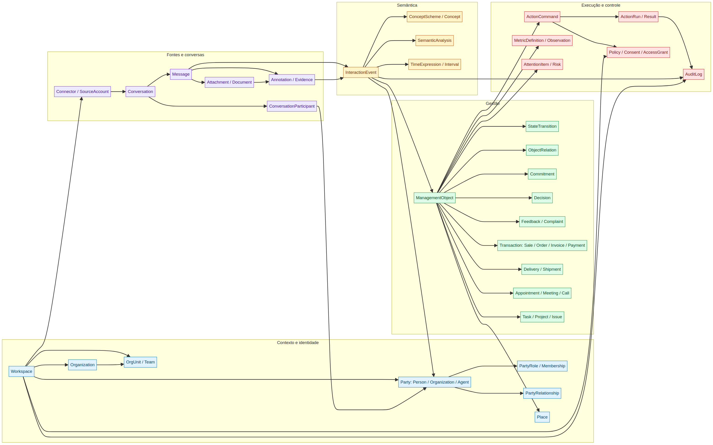

# ZapTrack — Especificação Master de Semântica, Ontologia, Entidades e Relacionamentos

**Versão:** 1.0  
**Data:** 26 de agosto de 2026  
**Autor:** Manus AI  
**Escopo:** conversas, mensagens, pessoas, organizações, relações, ações, intenções, eventos, objetos de gestão, estados, evidências, proveniência, métricas, comandos e governança.

> **Tese central:** o ZapTrack deve converter a atividade conversacional da empresa em uma estrutura semântica viva de eventos, entidades, relações, objetos de gestão, decisões, compromissos, métricas e ações — sem confundir o que foi dito com o que foi proposto, confirmado ou executado.

---

## 1. Resumo executivo

O ZapTrack não é apenas um classificador de mensagens, um resumidor, um CRM ou um gestor de tarefas. Ele deve ser uma **camada universal de interpretação e estruturação da atividade empresarial**, capaz de compreender conversas entre a organização e clientes, prospects, colaboradores, gestores, sócios, parceiros, fornecedores, prestadores, grupos e comunidades.

A amplitude desejada inclui solicitações, perguntas, informações, agendamentos, reuniões, ligações, visitas, cancelamentos, reagendamentos, vendas, compras, cotações, pedidos, contratações, contratos, aprovações, recusas, cobranças, pagamentos, reembolsos, entregas, envios, devoluções, reclamações, elogios, avaliações, decisões, tarefas, riscos e demais acontecimentos relevantes.

A recomendação é não modelar esse universo como uma lista plana de milhares de intenções. A universalidade deve ser obtida por composição:

```text
ator
+ contraparte
+ relação
+ ato linguístico
+ ação de negócio
+ objeto
+ estado
+ tempo
+ valor
+ local
+ evidência
+ compromisso
+ risco
+ próximo passo
```

A unidade central é o **InteractionEvent** — evento de interação — que representa algo observável, afirmado, proposto ou inferido a partir de uma conversa. Esse evento pode gerar zero, um ou vários **ManagementObjects** — objetos de gestão — que são as unidades acompanháveis do ZapTrack.

A fórmula operacional é:

> **Mensagem → evidência → interpretação → evento → objeto de gestão → ação → resultado → aprendizado.**

---

## 2. Conclusão da pesquisa de referências

A pesquisa combinou o corpus do ZapTrack com recomendações e vocabulários de padrões semânticos, organizacionais, temporais, de atividades, evidências e modelos empresariais.

| Referência | Contribuição para o ZapTrack | Decisão recomendada |
|---|---|---|
| W3C SKOS | Conceitos, rótulos, sinônimos, hierarquias, notas, esquemas e mapeamentos | Usar para taxonomias e vocabulários controlados |
| W3C RDF | Recursos, propriedades, literais, grafos e intercâmbio sem perda de significado | Adotar IDs e relações explícitas; exportação futura |
| W3C OWL 2 | Classes, propriedades, indivíduos, restrições e inferência formal | Usar como referência conceitual; não começar com raciocinador completo |
| W3C PROV-O | Entidades, atividades, agentes e proveniência | Tornar origem, versão, executor e derivação obrigatórios |
| W3C Activity Streams | Actor, activity, object, target, result e instrument | Inspirar o contrato de eventos e ações |
| W3C JSON-LD | Contextos, IDs, tipos e serialização JSON de linked data | Manter contratos exportáveis sem obrigar RDF no MVP |
| W3C SHACL | Shapes, constraints, severidade e relatórios de validação | Implementar schemas/constraints desde o início |
| W3C ORG | Organizações, unidades, membership, papéis, cargos, sites e mudanças | Modelar PartyRole/Membership contextual e temporal |
| W3C OWL-Time | Instantes, intervalos, duração e relações temporais | Separar instante, intervalo, prazo, recorrência e timezone |
| IETF iCalendar | Eventos, tarefas, participantes, status, prazo, RRULE e RECURRENCE-ID | Compatibilizar agenda e recorrência conceitualmente |
| W3C Web Annotation | Body, Target, selectors, motivação, autoria e trechos | Modelar evidências navegáveis em mensagens, áudio e documentos |
| Schema.org Action/Event/Order | Agente, objeto, participante, resultado, tempo, evento e transação | Reutilizar padrões de ação, evento e pedido |
| Dynamics 365 / HubSpot | Objetos, propriedades, associações, oportunidades, pedidos, pagamentos, atividades e casos | Usar objetos tipados ligados por associações, sem duplicar por departamento |
| GS1 EPCIS | Eventos de visibilidade organizados por what/when/where/why | Inspirar pedidos, envios, entregas e rastreabilidade |

O W3C descreve SKOS como um modelo comum para compartilhar sistemas de organização do conhecimento, incluindo taxonomias e tesauros.[1] RDF fornece a estrutura sujeito–predicado–objeto para expressar relações entre recursos.[2] OWL 2 formaliza classes, propriedades, indivíduos e restrições para raciocínio computacional.[3] PROV-O fornece classes e propriedades para intercambiar proveniência em contextos diferentes.[4]

> **“The Activity Streams 2.0 model details a model for representing potential and completed activities.”** — W3C Activity Streams 2.0.[5]

Essa distinção entre atividade potencial e concluída é decisiva para o ZapTrack: “vamos enviar” não é “enviado”; “podemos cancelar?” não é “cancelado”; “vou pagar” não é “pago”.

---

## 3. Distinções fundamentais

### 3.1 Taxonomia

Taxonomia é a organização hierárquica de conceitos. Ela responde: **“que tipo de coisa é esta?”**

Exemplo:

```text
Ação de negócio
└── Financeiro
    └── Pagamento
        ├── Promessa de pagamento
        ├── Pagamento iniciado
        ├── Pagamento concluído
        └── Pagamento estornado
```

### 3.2 Ontologia

Ontologia define classes, propriedades, relações, restrições e regras. Ela responde: **“o que existe, como se relaciona e o que pode ser inferido?”**

### 3.3 Vocabulário controlado

Vocabulário associa códigos a rótulos humanos, sinônimos, abreviações, exemplos, definições, notas, riscos e versões. Ele responde: **“como as pessoas chamam isso?”**

### 3.4 Modelo físico

O modelo físico implementa o conhecimento em tabelas, JSONB, índices, APIs, eventos e views. Ele responde: **“como armazenar e consultar isso com confiabilidade?”**

A ontologia do ZapTrack não deve ser confundida com o banco de dados. O banco pode ser relacional e, ainda assim, suportar um grafo semântico lógico por meio de IDs, associações e eventos.

---

## 4. Princípios de design semântico

### 4.1 Universalidade por composição

Novos casos devem ser representados combinando conceitos existentes. Não criar uma nova tela ou agente para cada verbo.

### 4.2 Separação entre linguagem e negócio

“Você pode entregar amanhã?” é uma pergunta sobre uma entrega. “Entrego amanhã” é um compromisso. “Entrega realizada” é um evento concluído. O modelo precisa manter essas diferenças.

### 4.3 Evidência antes de conclusão

Toda inferência relevante aponta para uma mensagem, um trecho de áudio, uma página de documento, uma imagem ou uma fonte de sistema.

### 4.4 Incerteza explícita

`unknown`, `other`, `ambiguous`, `not_applicable`, `proposed` e `low_confidence` são estados válidos. O ZapTrack deve preferir abstinência a uma falsa certeza.

### 4.5 Contexto relacional

Cliente, colaborador, parceiro e fornecedor não devem ser tipos globais imutáveis. São papéis de uma pessoa ou organização em determinado workspace, relação e período.

### 4.6 Tempo como entidade

“Amanhã”, “até sexta”, “no próximo mês”, “toda segunda” e “depois da reunião” não são apenas strings. Precisam de expressão original, normalização, precisão, timezone, intervalo, prazo e recorrência.

### 4.7 Proveniência e reversibilidade

A mensagem original é imutável. A interpretação é versionada. O objeto é alterável com histórico. A ação possui comando, autorização, execução e resultado.

### 4.8 Ação proporcional ao risco

Buscar e resumir pode ser automático. Pagar, cancelar, cobrar, assinar, excluir ou enviar uma mensagem externa exige autorização e confirmação proporcionais.

---

## 5. Ontologia superior do ZapTrack

A camada superior precisa ser pequena, estável e reutilizável:

| Classe | Definição | Exemplos |
|---|---|---|
| `Thing` | Qualquer recurso identificável | Pessoa, pedido, mensagem, local |
| `Agent` | Entidade capaz de agir ou assumir responsabilidade | Pessoa, organização, sistema, agente IA |
| `Person` | Agente humano | Cliente, colaborador, gestor |
| `Organization` | Agente organizacional | Empresa, fornecedor, parceiro, equipe |
| `Place` | Local físico ou virtual | Loja, sala, endereço, chamada online |
| `TimeEntity` | Instante, intervalo, prazo ou recorrência | Amanhã, reunião, vencimento |
| `InformationObject` | Conteúdo informacional | Mensagem, áudio, imagem, PDF, link |
| `Activity` | Algo que ocorre, pode ocorrer ou é executado | Reunião, análise, envio, pagamento |
| `Event` | Ocorrência observada ou afirmada | Mensagem recebida, entrega concluída |
| `State` | Condição de um recurso em um momento | Aprovado, atrasado, pago |
| `Value` | Quantidade, valor, medida ou código | R$ 500, 3 itens, nota 10 |
| `Evidence` | Recurso que sustenta uma afirmação | Trecho, comprovante, arquivo |
| `Policy` | Regra de acesso, risco, retenção ou ação | Exigir aprovação para pagamento |
| `Metric` | Medição definida sobre eventos ou objetos | Tempo de resposta, volume de vendas |

O vocabulário Schema.org descreve ações por meio de agente, objeto, participantes, instrumento, local, tempo, resultado e status.[11] O ZapTrack deve aproveitar essa estrutura e acrescentar intenção, estado conversacional, evidência, confiança, compromisso e autorização.

---

## 6. Núcleo da ontologia

| Classe | Subclasses | Função |
|---|---|---|
| `Workspace` | Organização, unidade, projeto | Limite de dados, identidade e políticas |
| `Party` | Person, Organization, Team, SystemAgent | Participante identificável |
| `PartyRole` | Customer, Employee, Partner, Supplier, Prospect | Papel contextual |
| `PartyRelationship` | BuysFrom, Supplies, Employs, PartnersWith | Relação entre parties |
| `Conversation` | Direct, Group, Thread, Imported | Contexto comunicacional |
| `Message` | Text, Audio, Image, Document, Link, Location, Reaction | Evidência bruta |
| `InteractionEvent` | Observation, Request, Proposal, Confirmation, Commitment, Feedback | Significado observado |
| `BusinessAction` | Schedule, Buy, Sell, Pay, Deliver, Approve, Complain | Ação de negócio |
| `BusinessObject` | Product, Service, Order, Contract, Invoice, Payment | Objeto sobre o qual a atividade opera |
| `ManagementObject` | Task, Appointment, Opportunity, Complaint, Decision, Risk | Unidade acompanhável |
| `Commitment` | Promise, Deadline, Obligation, SLA | Compromisso de uma party |
| `Decision` | Proposal, Approval, Rejection, PolicyDecision | Decisão e autoridade |
| `Feedback` | Complaint, Praise, Review, Rating, Suggestion | Retorno e avaliação |
| `Document` | Quote, Proposal, Contract, Invoice, Receipt | Artefato documental |
| `ActionCommand` | Create, Update, Assign, Complete, Send, Export | Intenção autorizada de mudar/agir |
| `MetricDefinition` | Volume, Rate, Duration, Amount, Quality | Definição de indicador |

---

## 7. Taxonomia de atos linguísticos

O ato linguístico representa o que a mensagem faz na conversa:

```text
SpeechAct
├── Ask
│   ├── Question
│   ├── Request
│   ├── Inquiry
│   └── Clarification
├── Inform
│   ├── Notify
│   ├── Update
│   ├── Report
│   └── Share
├── Propose
│   ├── Offer
│   ├── Quote
│   ├── Invite
│   └── Counterproposal
├── Commit
│   ├── Promise
│   ├── Guarantee
│   ├── Reservation
│   └── DeadlineCommitment
├── Decide
│   ├── Approve
│   ├── Authorize
│   ├── Accept
│   ├── Reject
│   └── CancelDecision
├── Coordinate
│   ├── Schedule
│   ├── Reschedule
│   ├── Delegate
│   ├── Assign
│   └── Escalate
├── Evaluate
│   ├── Complain
│   ├── Praise
│   ├── Review
│   ├── Rate
│   └── Recommend
└── Negotiate
    ├── NegotiatePrice
    ├── NegotiateTerm
    ├── RequestDiscount
    └── Condition
```

O modelo deve permitir múltiplos atos linguísticos por mensagem. Uma mensagem pode conter uma aprovação e uma solicitação; uma reclamação e um pedido de reembolso; ou um cancelamento, reagendamento e envio de documento.

---

## 8. Taxonomia de ações de negócio

### 8.1 Atendimento

Solicitar suporte, responder dúvida, abrir chamado, registrar incidente, resolver, reabrir, escalar, fazer follow-up e encerrar atendimento.

### 8.2 Agenda e compromissos

Agendar, confirmar, reagendar, cancelar, realizar, não comparecer, remarcar, convidar, ligar, reunir, visitar, reservar e lembrar.

### 8.3 Comercial

Prospectar, qualificar, apresentar, cotar, enviar proposta, negociar, aprovar venda, vender, perder, renovar, recuperar, conceder desconto e fazer follow-up.

### 8.4 Compras e suprimentos

Solicitar cotação, comparar fornecedores, aprovar compra, comprar, encomendar, contratar fornecedor, receber, rejeitar, devolver e avaliar qualidade.

### 8.5 Contratos e serviços

Redigir, revisar, aprovar, assinar, ativar, renovar, alterar escopo, suspender, rescindir e cumprir obrigação.

### 8.6 Financeiro

Emitir fatura, cobrar, prometer pagamento, pagar, receber, parcelar, conciliar, contestar, estornar e reembolsar.

### 8.7 Pedidos e logística

Criar pedido, alterar pedido, separar, embalar, enviar, transportar, rastrear, entregar, atrasar, recusar e devolver.

### 8.8 Pessoas e trabalho

Criar tarefa, atribuir, delegar, iniciar, bloquear, revisar, aprovar, concluir, avaliar, orientar, alocar e resolver conflito.

### 8.9 Feedback e reputação

Reclamar, elogiar, avaliar, pontuar, recomendar, contestar, responder feedback e converter em melhoria.

### 8.10 Conhecimento e decisão

Perguntar, explicar, resumir, documentar, decidir, aprovar, comunicar decisão, pesquisar e comparar.

---

## 9. Taxonomia de objetos de gestão

| Família | Objetos |
|---|---|
| Solicitação | Request, Inquiry, SupportRequest, ApprovalRequest |
| Compromisso | Commitment, Promise, Obligation, SLA |
| Agenda | Appointment, Meeting, Call, Visit, Reservation |
| Comercial | Lead, Opportunity, Quote, Proposal, Sale, Renewal |
| Compras | PurchaseRequest, PurchaseOrder, Order, Return |
| Contrato | Contract, ServiceAgreement, SLA |
| Financeiro | Invoice, Charge, Payment, Refund, Dispute |
| Fulfillment | Shipment, Delivery, Pickup, Tracking |
| Atendimento | Case, Complaint, Incident, Resolution |
| Trabalho | Task, Project, Initiative, Milestone, Issue |
| Decisão | Decision, Approval, Rejection, PolicyDecision |
| Feedback | Feedback, Review, Rating, Praise, Suggestion |
| Documento | Document, Receipt, Proof, Proposal, Contract |
| Risco | Risk, Exception, Delay, Blocker |

Documentos, áudios, imagens e links são `InformationObject`/`Evidence` por padrão. Podem apoiar um contrato, pagamento, pedido ou entrega, mas não devem ser classificados automaticamente como esses objetos somente pelo nome do arquivo.

---

## 10. Estados e transições

O ZapTrack deve possuir uma máquina de estados configurável por tipo de objeto. Uma sequência geral é:

```text
mentioned
  → proposed
  → requested
  → acknowledged
  → approved
  → scheduled
  → confirmed
  → committed
  → in_progress
  → completed
```

Estados alternativos incluem:

```text
cancelled
rejected
failed
blocked
disputed
expired
no_show
reopened
superseded
unknown
```

Um estado não pode ser inferido apenas por uma palavra. “Pago” pode ser uma declaração, uma promessa, uma confirmação ou uma referência histórica. O sistema precisa considerar ator, contexto, evidência, fonte e transição válida.

### Exemplos

| Texto | Interpretação correta |
|---|---|
| “Podemos marcar para amanhã?” | Request + Appointment + Proposed |
| “Reunião confirmada para amanhã às 10h.” | Confirmation + Appointment + Confirmed |
| “Vou pagar sexta.” | Promise + Payment + Committed |
| “Pagamento recebido.” | Inform/Confirm + Payment + Completed candidate |
| “Podemos cancelar o pedido?” | Request + Cancel + Order + Proposed/requested |
| “Pedido cancelado.” | Inform + Cancel + Order + Cancelled |
| “Acho que foi entregue.” | Uncertain delivery signal |
| “Entrega concluída, segue comprovante.” | Delivery + Completed + Evidence |

---

## 11. Modelo temporal

A pesquisa em OWL-Time recomenda distinguir instantes e intervalos, com início, fim, duração e relações como antes/depois.[9] O RFC 5545 acrescenta componentes de eventos e tarefas, organizadores, participantes, status, prazos, regras de recorrência e identificação de instâncias.[10]

### TimeExpression

```text
id
raw_expression
normalized_start
normalized_end
due_at
precision              // exact, day, week, approximate, relative
timezone
recurrence_rule
reference_event_id
source_message_id
confidence
```

O ZapTrack deve guardar tanto “amanhã de manhã” quanto o intervalo calculado no timezone do workspace. Um reagendamento deve preservar a data anterior e registrar a nova ocorrência.

### Relações temporais

```text
before
after
during
overlaps
starts
finishes
meets
contains
supersedes
```

Essas relações permitem detectar atrasos, conflitos de agenda, dependências, compromissos vencidos e sequências operacionais.

---

## 12. Entidades e relacionamentos



### 12.1 Contexto organizacional

```text
Workspace
├── Organization
│   ├── OrgUnit
│   ├── Team
│   └── Site
├── Member
├── Party
├── Connector
├── Conversation
├── ManagementObject
└── Policy
```

A ontologia ORG da W3C oferece um núcleo para organizações, unidades, membership, papéis, cargos, locais e eventos de mudança, e recomenda extensões específicas por domínio.[8] O ZapTrack deve seguir essa lógica: `PartyRole` e `Membership` são entidades contextuais, com período e autoridade.

### 12.2 Party e papéis

```text
Party
├── Person
├── Organization
├── Team
├── SystemAgent
└── UnknownParty
```

Uma Party pode ser cliente em uma conversa, representante de fornecedor em outra e colaborador em um workspace diferente. O papel não deve ser fixado na identidade global.

```text
Party ──has_role──> PartyRole
PartyRole ──in_workspace──> Workspace
PartyRole ──at_organization/unit──> Organization/OrgUnit
PartyRole ──valid_during──> TimeInterval
Party ──has_relationship──> PartyRelationship
```

### 12.3 Conversas e mensagens

```text
Connector ──provides──> SourceAccount
SourceAccount ──contains──> Conversation
Conversation ──has_participant──> Party
Conversation ──has_message──> Message
Message ──replies_to/quotes/forwards──> Message
Message ──has_attachment──> Attachment
Message ──generates──> InteractionEvent
```

`ConversationParticipant` deve preservar o papel contextual do participante, como remetente, destinatário, administrador, observador ou agente.

### 12.4 InteractionEvent

```text
InteractionEvent
├── actor
├── counterparty
├── relationship
├── speech_act
├── business_action
├── subject/object
├── state
├── temporal_data
├── place
├── value
├── commitment
├── feedback
├── risk
├── next_step
└── evidence
```

O evento pode ser originado por mensagem, arquivo, integração, ação do sistema ou correção humana.

### 12.5 ManagementObject

```text
InteractionEvent ──proposes/updates──> ManagementObject
ManagementObject ──has_state──> State
ManagementObject ──has_transition──> StateTransition
ManagementObject ──related_to──> ManagementObject
ManagementObject ──assigned_to──> Party/Team
ManagementObject ──about──> Party/Organization/Product/Service
ManagementObject ──belongs_to──> Workspace/Project
```

### 12.6 Processos comerciais

```text
Party/Organization ──has_role──> Prospect/Customer
Opportunity ──for──> Customer
Quote ──supports──> Opportunity
Quote ──offers──> Product/Service
Sale ──converts──> Opportunity
Order ──accepts──> Quote/Offer
Order ──contains──> LineItem
Invoice ──for──> Order/Contract
Payment ──settles──> Invoice
```

A documentação do Dynamics 365 separa lead, oportunidade, cotação, pedido, produto e fatura em diferentes fases do processo comercial.[15] A documentação do HubSpot descreve objetos, propriedades e associações em uma mesma plataforma de dados.[14] O ZapTrack deve adotar essa separação conceitual, mas não tentar substituir ERP/CRM completo no início.

### 12.7 Compras, pedidos e entregas

```text
PurchaseRequest ──requests──> Product/Service
PurchaseOrder ──placed_with──> Supplier
Order ──contains──> LineItem
Shipment ──fulfills──> Order
Delivery ──delivers──> Order/LineItem
Delivery ──from/to──> Place
Delivery ──handled_by──> Party/Organization
Delivery ──has_tracking──> TrackingEvent
```

Schema.org Order relaciona pedido, oferta aceita, cliente, vendedor, itens, entrega, fatura, vencimento e método de pagamento.[13] GS1 EPCIS estrutura eventos de visibilidade por “what, where, when and why” e permite compartilhar eventos entre organizações.[16] Esses padrões reforçam o uso de eventos para rastrear pedido, envio, recebimento e entrega.

### 12.8 Atendimento e feedback

```text
Case/Complaint ──raised_by──> Party
Case/Complaint ──about──> Order/Product/Service/Delivery
Case ──assigned_to──> Party/Team
Feedback ──provided_by──> Party
Feedback ──about──> Product/Service/Interaction/Organization
Feedback ──results_in──> Task/Decision/Improvement
```

Reclamação, elogio e avaliação pertencem à mesma família de feedback, mas possuem polaridade, severidade, nota, resposta e ação recomendada diferentes.

### 12.9 Trabalho e decisão

```text
Task ──assigned_to──> Party/Team
Task ──derived_from──> InteractionEvent/Decision/Complaint
Task ──depends_on──> Task
Decision ──proposed_by──> Party
Decision ──approved_by──> Party
Decision ──applies_to──> Project/Policy/BusinessObject
Risk ──mitigated_by──> Task/Decision
```

---

## 13. InteractionEvent: contrato semântico

```json
{
  "event_id": "evt_01",
  "event_type": "interaction.structured",
  "schema_version": 1,
  "workspace_id": "ws_01",
  "source": {
    "channel": "whatsapp",
    "conversation_id": "conv_01",
    "message_ids": ["msg_01"],
    "captured_at": "2026-08-26T18:00:00Z"
  },
  "actor": {
    "party_id": "party_customer_01",
    "role": "customer",
    "confidence": 0.98
  },
  "counterparties": [
    {
      "party_id": "party_company_01",
      "role": "company",
      "confidence": 0.99
    }
  ],
  "relationship": "commercial",
  "speech_act": {
    "type": "request",
    "confidence": 0.93
  },
  "business_action": {
    "type": "schedule",
    "confidence": 0.91
  },
  "subject": {
    "type": "meeting",
    "attributes": {
      "topic": "revisão de proposta"
    }
  },
  "state": {
    "value": "proposed",
    "confidence": 0.88
  },
  "temporal": {
    "raw_expression": "amanhã às 10h",
    "start_at": "2026-08-27T10:00:00-03:00",
    "timezone": "America/Sao_Paulo",
    "precision": "hour",
    "confidence": 0.84
  },
  "next_step": {
    "type": "confirm_details",
    "confidence": 0.72
  },
  "evidence": [
    {
      "message_id": "msg_01",
      "selector_type": "text_quote",
      "quote": "Podemos marcar para amanhã às 10h?"
    }
  ],
  "uncertainties": ["appointment_not_confirmed"],
  "confidence": 0.88,
  "taxonomy_version": "taxonomy-1.0.0",
  "pipeline_version": "semantic-pipeline-1.0.0"
}
```

---

## 14. ManagementObject: contrato gerencial

```json
{
  "object_id": "obj_01",
  "workspace_id": "ws_01",
  "object_type": "appointment",
  "subtype": "meeting",
  "title": "Revisão de proposta com Alfa",
  "status": "proposed",
  "priority": "medium",
  "owner_id": "party_company_01",
  "participants": ["party_customer_01", "party_company_01"],
  "related_conversations": ["conv_01"],
  "source_event_ids": ["evt_01"],
  "due_at": "2026-08-27T10:00:00-03:00",
  "attributes": {
    "topic": "revisão de proposta"
  },
  "confidence": 0.88,
  "review_state": "needs_confirmation",
  "created_at": "2026-08-26T18:01:00Z",
  "updated_at": "2026-08-26T18:01:00Z"
}
```

O objeto possui um núcleo comum para busca, feed, filtros, métricas e ações. Seus atributos específicos devem ser validados por schema.

---

## 15. Evidência, anotações e proveniência

A Web Annotation Data Model define anotações como relações entre um **Body** e um **Target**, com seletores para trechos, autoria, data, motivação e contexto.[17] Isso se adapta perfeitamente ao ZapTrack:

```text
Evidence
├── target: Message / Audio / Image / PDF / Link
├── selector: Quote / Offset / Timestamp / Page / Region
├── body: Claim / Event / Object / Label
├── creator: Human / Model / Rule / Integration
├── motivation: Extract / Classify / Support / Correct
├── created_at
└── confidence
```

PROV-O reforça a separação entre entidade, atividade e agente na proveniência.[4] O ZapTrack deve registrar:

| Pergunta | Campo/proveniência |
|---|---|
| De onde veio? | Message, Attachment, Connector, ImportBatch |
| Quem produziu? | Human, Model, Rule, Integration |
| Qual atividade ocorreu? | Ingestion, Transcription, Extraction, Review, Action |
| Qual versão? | Model, Prompt, Taxonomy, Schema, Rule |
| Quando? | ObservedAt, CreatedAt, ProcessedAt |
| O que derivou? | DerivedFrom, Supports, Supersedes |
| Qual certeza? | Confidence por dimensão |

Sem isso, o usuário não consegue confiar, corrigir ou auditar a transformação.

---

## 16. Ontologia de ação e comando

Um `InteractionEvent` pode descrever uma ação mencionada ou proposta. Um `ActionCommand` representa uma intenção autorizada de alterar dados ou produzir efeito.

```text
InteractionEvent
      ↓
ManagementObject proposal
      ↓
ActionCommand
      ↓
ActionApproval
      ↓
ActionRun
      ↓
ActionResult
      ↓
StateTransition + AuditLog
```

### ActionCommand

```text
command_id
workspace_id
requested_by_party_id
channel
intent
business_action
object_ids
parameters_json
risk_level
policy_decision
confirmation_state
idempotency_key
created_at
expires_at
```

O agente no WhatsApp e a aplicação externa devem chamar a mesma camada de comandos. O agente nunca acessa tabelas diretamente nem executa SQL arbitrário.

---

## 17. Métricas e atenção

### MetricDefinition

```text
metric_id
workspace_id
code
name
definition
formula
source_event_types
source_object_types
filters
unit
timezone
freshness_policy
version
owner
```

### Tipos de métricas

| Família | Exemplos |
|---|---|
| Volume | Eventos, mensagens, objetos, pedidos, reclamações |
| Conversão | Proposta → aprovação, lead → venda, cotação → compra |
| Tempo | Resposta, aprovação, pagamento, entrega, resolução |
| Cumprimento | Compromissos no prazo, tarefas concluídas, reuniões realizadas |
| Exceção | Atrasos, falhas, cancelamentos, reaberturas, disputas |
| Qualidade | Reclamações, elogios, avaliações, retrabalho |
| Financeiro | Cotado, vendido, cobrado, pago, vencido, estornado |
| Carga | Pendências por owner, equipe, área ou parceiro |

`AttentionItem` é uma projeção para “o que precisa de atenção”, derivada de atraso, baixa confiança, mudança importante, reclamação crítica, pagamento vencido, compromisso próximo ou decisão pendente.

---

## 18. Regras de inferência segura

| Regra | Inferência | Limite |
|---|---|---|
| R1 | Pedido de compra pode gerar PurchaseRequest | Não é compra concluída |
| R2 | “Aprovado” pode gerar Approval | Exige objeto e autoridade resolvidos |
| R3 | “Vou pagar sexta” gera Commitment | Não é pagamento realizado |
| R4 | “Pagamento recebido” gera Payment completed candidate | Preferir comprovante/fonte transacional |
| R5 | “Reunião confirmada” gera Appointment confirmed | Exige data/contexto suficientes |
| R6 | “Cliente reclamou” gera Complaint | Evidência deve sustentar a queixa |
| R7 | “Entrega atrasou” gera Delivery risk/exception | Exige contexto de entrega |
| R8 | “Podemos cancelar?” gera Cancel request | Não cancelar automaticamente |
| R9 | Documento chamado “contrato” gera Document candidate | Não é contrato válido por nome |
| R10 | “Parece interessado” gera Opportunity signal | Não é venda |
| R11 | “Depois vemos” gera Ambiguous | Não criar compromisso |
| R12 | “Ok” encerra conversa apenas se contexto permitir | Não concluir objeto automaticamente |

---

## 19. Modelo relacional lógico

### Tabelas de contexto e identidade

```text
workspaces
organizations
org_units
teams
sites
members
parties
party_identifiers
party_roles
party_relationships
memberships
authorities
```

### Tabelas de fontes e conversa

```text
connectors
source_accounts
import_batches
conversations
conversation_participants
messages
message_relations
attachments
transcripts
ocr_results
links
```

### Tabelas semânticas

```text
concept_schemes
concepts
interaction_events
semantic_analyses
evidence
annotations
entities
entity_mentions
time_expressions
places
```

### Tabelas gerenciais

```text
management_objects
object_relations
state_definitions
state_transitions
commitments
decisions
feedback
```

### Tabelas de ação e governança

```text
action_commands
action_approvals
action_runs
action_results
metric_definitions
metric_observations
attention_items
policies
consents
access_grants
retention_rules
audit_logs
feedback_corrections
```

A implementação deve começar com tabelas fortes para o núcleo e `attributes_json` para especializações. Tabelas específicas só devem ser criadas quando houver necessidade real de consulta, constraint, integração, relatório ou permissão.

---

## 20. Cardinalidades principais

| Relação | Cardinalidade |
|---|---|
| Workspace → Members | 1:N |
| Workspace → Parties | 1:N |
| Workspace → Connectors | 1:N |
| Connector → SourceAccounts | 1:N |
| SourceAccount → Conversations | 1:N |
| Conversation → Messages | 1:N |
| Conversation ↔ Parties | N:N via ConversationParticipant |
| Message → Attachments | 1:N |
| Message → InteractionEvents | 1:N |
| InteractionEvent → Evidence | 1:N |
| InteractionEvent → ManagementObjects | 0:N |
| ManagementObject → StateTransitions | 1:N |
| ManagementObject ↔ ManagementObjects | N:N via ObjectRelation |
| ManagementObject → ActionCommands | 0:N |
| ActionCommand → ActionRuns | 1:N |
| MetricDefinition → Observations | 1:N |
| Party/Role → AccessGrants | 1:N |
| Qualquer recurso governado → AuditLogs | 1:N |

---

## 21. Constraints e shapes essenciais

SHACL define shapes e constraints para validar grafos, com relatório de conformidade, nó, caminho, valor, mensagem e severidade.[7] O ZapTrack deve implementar a mesma disciplina mesmo que comece com Zod/JSON Schema e constraints SQL.

### Constraints mínimas

| Entidade | Constraint |
|---|---|
| `Message` | Tem conversa, origem, timestamp ou precisão temporal e autor/unknown |
| `InteractionEvent` | Tem ação/ato, evidência, workspace e confiança |
| `ManagementObject` | Tem tipo, estado, origem, workspace e histórico |
| `Appointment` | Se confirmado, tem participante/organizador e horário suficiente |
| `Payment` | Se concluído, tem valor/data e evidência adequada |
| `Approval` | Tem decisor com autoridade ou fica como proposta |
| `Delivery` | Tem pedido/objeto ou é explicitamente previsão incerta |
| `Complaint` | Tem autor, alvo/contexto e evidência |
| `ActionCommand` | Tem ator, alvo, parâmetros, risco, policy e idempotência |
| `MetricDefinition` | Tem fórmula, fontes, período, timezone e versão |
| `Evidence` | Tem alvo, selector, origem e creator |

---

## 22. Resolução de entidades

A resolução de entidades é uma das partes mais importantes do ZapTrack. A mesma pessoa pode ser citada como “João”, “João da Beta”, “o financeiro” ou por número de telefone; uma organização pode aparecer com nome comercial, razão social ou apelido.

A resolução deve combinar identificadores explícitos, aliases, participantes, histórico de relações, unidade/site, contexto temporal, similaridade semântica e confirmação humana.

Não fundir entidades apenas porque possuem o mesmo nome. O sistema deve permitir hipóteses de identidade, merge e unmerge auditáveis.

---

## 23. Cobertura por cenários

| Conversa | Saída esperada |
|---|---|
| “Pode me mandar a proposta?” | Request + Proposal/Quote + tarefa potencial |
| “A proposta foi aprovada.” | Approval + Proposal + estado approved |
| “Vamos marcar uma reunião?” | Request + Appointment + proposed |
| “Reunião confirmada terça.” | Appointment + confirmed + temporal interval |
| “Cancele e reagende para sexta.” | Cancel + Reschedule + old/new appointment |
| “Vou comprar 20 unidades se fizer R$ 50.” | PurchaseRequest + Offer/Condition + negociação |
| “Compra aprovada, pode emitir.” | Approval + PurchaseRequest/Order |
| “Pagamento feito, segue comprovante.” | Payment candidate + Attachment + Evidence |
| “A entrega atrasou.” | Delivery exception + Risk + AttentionItem |
| “O cliente reclamou e quer reembolso.” | Complaint + RefundRequest |
| “Parabéns, nota 10.” | Praise + Rating |
| “A Ana fica responsável pelo relatório.” | Task + Assignment + Commitment |
| “Acho que está resolvido.” | Low-confidence resolution signal |
| “Não faça nada, só estou avisando.” | Informative event; sem tarefa automática |

---

## 24. Pipeline semântico recomendado

### Passagem 1: cobertura ampla e econômica

A primeira passagem roda sobre mensagens ou janelas relevantes e identifica idioma, conversa, autor, segmentação, atos linguísticos, candidatos a ação, entidades básicas, datas, valores e confiança.

### Passagem 2: estruturação profunda

A segunda passagem é acionada somente quando há candidato relevante. Ela resolve participante, relação, objeto, estado, compromisso, tempo, valor, evidência, risco e próximo passo.

### Passagem 3: projeção e governança

A terceira etapa decide se o evento gera objeto, alerta, métrica ou apenas contexto; aplica schemas, transições, políticas, revisão e possibilidade de ação.

Essa arquitetura reduz custo e evita que toda mensagem social gere objetos falsos.

---

## 25. Aplicação e agente no WhatsApp

A aplicação externa e o agente no WhatsApp devem ser duas interfaces do mesmo núcleo:

| Capacidade | WhatsApp | Aplicação |
|---|---|---|
| Buscar | Linguagem natural e comandos | Filtros, busca híbrida e timeline |
| Consultar objeto | Resposta compacta | Detalhe, histórico e relações |
| Revisar evento | Confirmação/correção curta | Revisão em massa e comparação |
| Ver evidência | Trecho e link | Conversa completa, áudio e página |
| Consultar métrica | Pergunta com período | Dashboard e drill-down |
| Criar tarefa | Comando e confirmação | Formulário, edição e lote |
| Ação sensível | Confirmação forte ou bloqueio | Centro de aprovação |
| Governança | Comandos limitados | Permissões, retenção, exportação e auditoria |

O agente não é outra ontologia. Ele é uma superfície de consulta e comando sobre os mesmos eventos, objetos e relações.

---

## 26. Governança, privacidade e proveniência

Toda informação deve ser escopada por workspace, fonte, relação, membro e política. Dados de terceiros devem ser tratados como potencialmente pessoais. O produto deve registrar consentimento, finalidade, escopo, retenção, revogação e acesso.

O sistema precisa preservar:

- mensagem e payload originais;
- fonte e conta de origem;
- análise e versão do modelo;
- taxonomia e schema usados;
- evidência e seletor;
- correções humanas;
- ações executadas;
- resultados e falhas.

O usuário deve conseguir responder: **“por que o ZapTrack criou este objeto, qual mensagem usou, qual versão interpretou, quem confirmou e o que foi feito?”**

---

## 27. O que implementar primeiro

A ordem recomendada é:

| Fase | Entrega |
|---|---|
| 1 | Workspace, Party, PartyRole, Conversation, Message e Evidence |
| 2 | ConceptScheme, Concept, InteractionEvent e SemanticAnalysis |
| 3 | ManagementObject, State, StateTransition e ObjectRelation |
| 4 | Task, Appointment, Request, Opportunity, Complaint e Commitment |
| 5 | Order, Payment, Delivery, Contract e Feedback |
| 6 | ActionCommand, Approval, ActionRun, Metrics e AttentionItem |
| 7 | JSON-LD exportável, SHACL/shape validation e integrações externas |

A cobertura semântica pode começar ampla desde o início, mas automações profundas devem ser liberadas de forma progressiva. O sistema pode reconhecer pagamentos, contratos, reclamações e entregas desde cedo sem executar automaticamente ações financeiras ou externas.

---

## 28. O que não fazer

Não criar uma intenção/tabela/tela para cada verbo. Não transformar toda mensagem em tarefa. Não confundir sentimento com estado de negócio. Não tratar “parece interessado” como venda. Não tratar “vou pagar” como pagamento. Não apagar histórico ao reagendar. Não misturar papel de usuário, cliente e fornecedor na mesma entidade rígida. Não permitir que o LLM consulte banco livremente. Não usar um grafo dedicado antes de provar necessidade. Não prometer acesso a dados que a fonte não disponibiliza.

Também não tentar lançar todos os fluxos completos de CRM, ERP, atendimento, financeiro, RH e logística ao mesmo tempo. A ontologia pode ser universal; a profundidade operacional deve ser progressiva.

---

## 29. Veredito final

A estrutura semântica e ontológica correta do ZapTrack é uma **ontologia orientada a interações, eventos, entidades, estados, evidências e objetos de gestão**.

A decisão mais importante é separar:

```text
linguagem da mensagem
≠ intenção comunicacional
≠ ação de negócio
≠ objeto
≠ estado
≠ compromisso
≠ ação executada
```

O ZapTrack deve identificar amplamente, estruturar com dimensões estáveis, preservar evidência, resolver entidades e relações, criar objetos quando houver valor gerencial, medir o que foi definido e agir somente com autorização proporcional ao risco.

> **O produto não deve apenas entender conversas. Deve construir uma representação operacional confiável da empresa a partir delas.**

Essa arquitetura permite que clientes, colaboradores, parceiros, fornecedores, pedidos, compras, vendas, reuniões, pagamentos, entregas, contratos, reclamações, elogios, avaliações, decisões e riscos coexistam em um único sistema semântico, sem que o produto perca simplicidade, rastreabilidade ou governança.

---

## Referências

[1]: https://www.w3.org/TR/skos-reference/ — W3C, *SKOS Simple Knowledge Organization System Reference*.

[2]: https://www.w3.org/TR/rdf11-primer/ — W3C, *RDF 1.1 Primer*.

[3]: https://www.w3.org/TR/owl2-primer/ — W3C, *OWL 2 Web Ontology Language Primer*.

[4]: https://www.w3.org/TR/prov-o/ — W3C, *PROV-O: The PROV Ontology*.

[5]: https://www.w3.org/TR/activitystreams-core/ — W3C, *Activity Streams 2.0*.

[6]: https://www.w3.org/TR/json-ld11/ — W3C, *JSON-LD 1.1*.

[7]: https://www.w3.org/TR/shacl/ — W3C, *Shapes Constraint Language (SHACL)*.

[8]: https://www.w3.org/TR/vocab-org/ — W3C, *The Organization Ontology*.

[9]: https://www.w3.org/TR/owl-time/ — W3C, *Time Ontology in OWL*.

[10]: https://datatracker.ietf.org/doc/html/rfc5545 — IETF, *RFC 5545: Internet Calendaring and Scheduling Core Object Specification (iCalendar)*.

[11]: https://schema.org/Action — Schema.org, *Action*.

[12]: https://schema.org/Event — Schema.org, *Event*.

[13]: https://schema.org/Order — Schema.org, *Order*.

[14]: https://knowledge.hubspot.com/records/understand-objects — HubSpot Knowledge Base, *How to use objects for business processes*.

[15]: https://learn.microsoft.com/en-us/dynamics365/sales/developer/sales-entities-lead-opportunity-competitor-quote-order-invoice — Microsoft Learn, *Sales tables: lead, opportunity, competitor, quote, order, invoice*.

[16]: https://ref.gs1.org/standards/epcis/ — GS1, *EPCIS Standard*.

[17]: https://www.w3.org/TR/annotation-model/ — W3C, *Web Annotation Data Model*.

## Arquivos de apoio

- `zaptrack_semantic_scope.md`
- `zaptrack_semantic_research.md`
- `zaptrack_ontology_taxonomy_v1.md`
- `zaptrack_universal_event_contracts.md`
- `zaptrack_entity_relationship_model.md`
- `zaptrack_ontology_validation.md`
- `zaptrack_ontology_erd.png`
